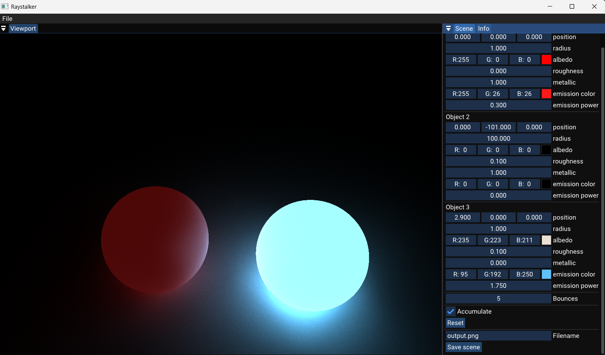

#                                           Raystalker

A multi-threaded Raytracing using C++ , Walnut GUI framework.
It has partial Pathtracing which will get more sophisticated overtime.

~40FPS on my CPU:
    **Intel(R) Core(TM) i5-10300H CPU @ 2.50GHz Cores:	4/8**


## Gallery


----


----


----



## Setup

### Prerequisites

- Vulkan SDK
- Visual studio 26 ( Recommmended)

It can work with other toolchain , but you'll have to manually set build system. 

```powershell

> git clone --recursive https://github.com/ArcShahi/RayStalker.git

# Run Setup.bat in scripts dir
> scripts\Setup.bat

# It'll generate VISUAL STUDIO solution file : Raystalker.slnx
```

>[!Warning]
> I've modified `Walnut/Random.hpp` , `Walnut/Random.cpp` to add `thread_local` in `s_RandomEngine`, so every thread get's it's own Random engine. It reduces random number generation.


## Usage

- Hold right mouse click and move the mouse to pan the camera around.
- Hold right mouse clikc and W A S D Q E to move the camera around.
- Click on object's value and drag them to change.
- Click 'Save scene' to save the image. Will be saved in solution directory.

## TODO
1. Move to GPU
3. IDK something something.


### Reference
- Ray tracing in one weekend 
- The Cherno YT 